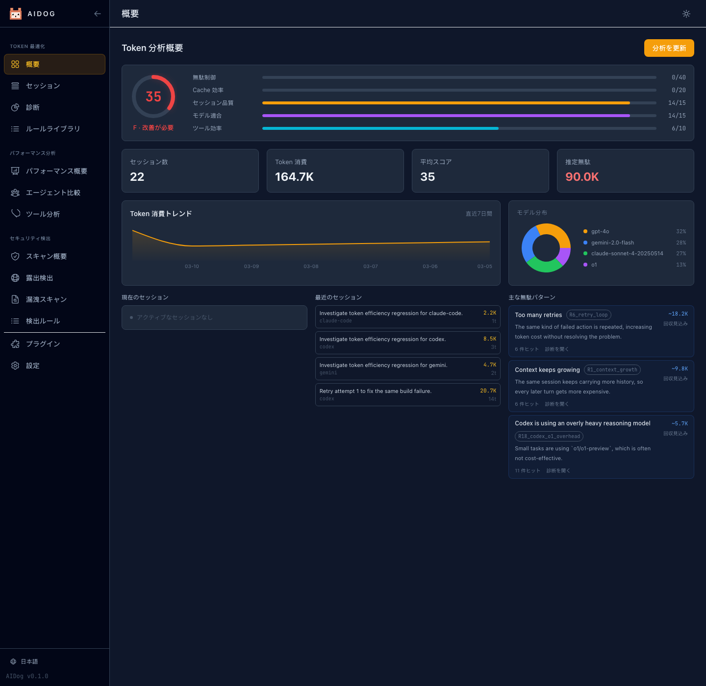
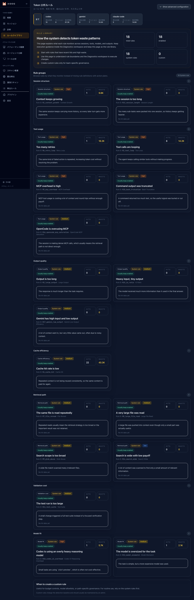
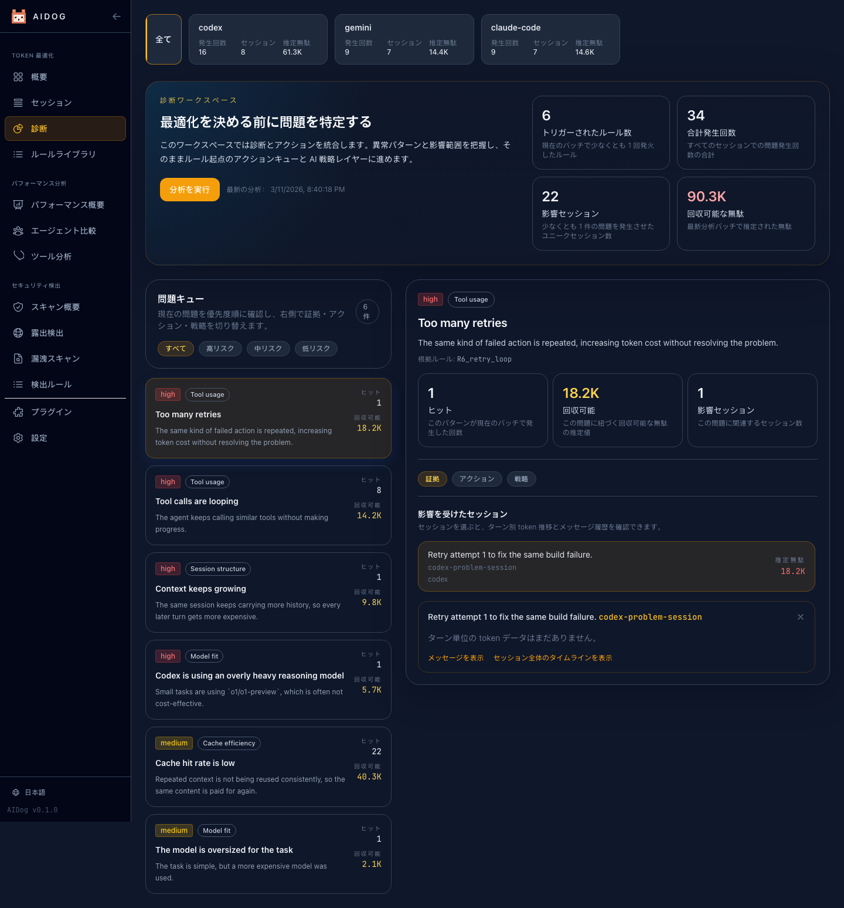
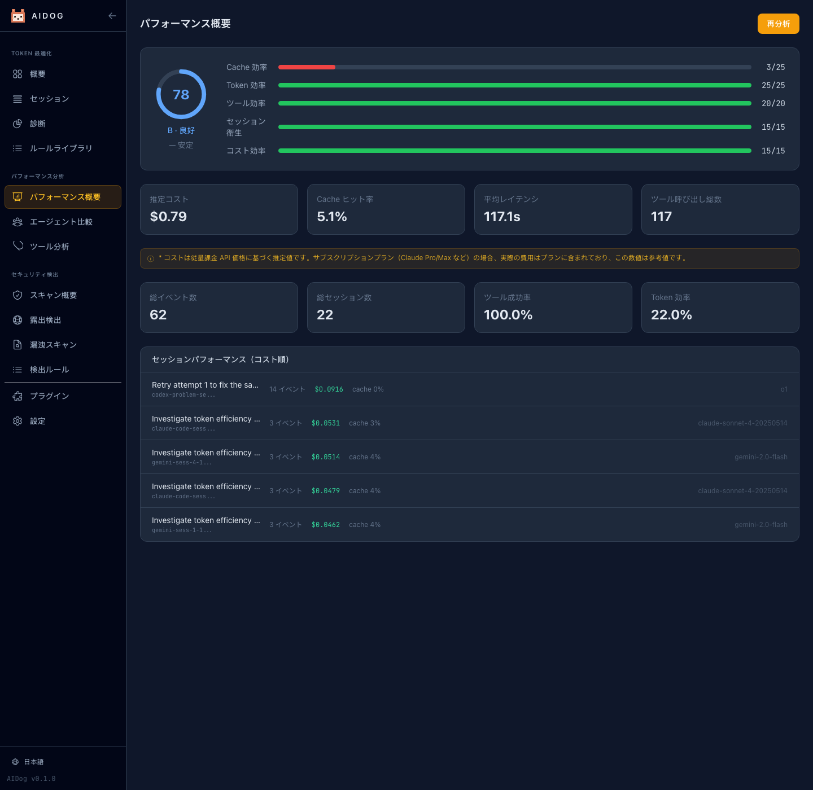
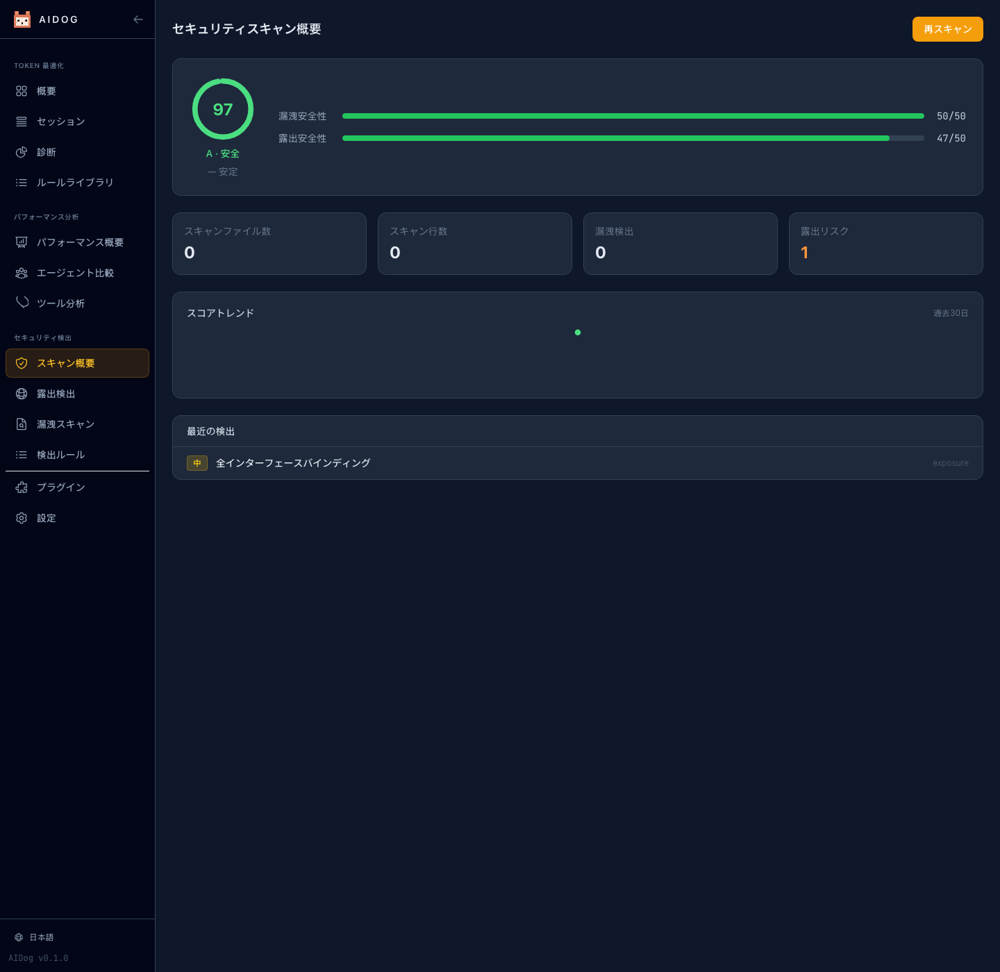

# AIDog


[English](README.md) | [简体中文](README.zh-CN.md) | 日本語

> AI Agent ワークフロー向けのツールキット。現在は Claude Code、Codex CLI、Gemini CLI、OpenCode、OpenClaw を標準収集対象とし、SDK ベースの Agent はプラグインで拡張でき、運用コスト最適化、性能改善、セキュリティスキャンをまとめて行えます。



`AIDog` は、AI Agent ワークフロー向けのローカルファースト CLI と Web ダッシュボードです。現在の組み込み収集対象は Claude Code、Codex CLI、Gemini CLI、OpenCode、OpenClaw で、SDK ベースや社内独自 Agent にはカスタムプラグインで拡張できます。コスト最適化、性能最適化、セキュリティスキャンを 1 か所で実行できます。

## 主な機能

- AI Agent 向けにコスト最適化、性能最適化、セキュリティスキャンを統合
- 現在の組み込み収集対象: Claude Code、Codex CLI、Gemini CLI、OpenCode、OpenClaw
- SDK ベース Agent、独自ランタイム、未対応 CLI はプラグインで拡張可能
- token の無駄を見つけ、ルールライブラリと改善アクションにつなげるコスト最適化
- ヘルススコア、傾向分析、モデルとツールの可視化による性能最適化
- コンテキスト肥大化、ツールループ、リトライ過多、キャッシュ不調などを検知するルールエンジン
- 漏えいリスクと公開状態を確認するセキュリティスキャン
- token、コスト、セッション、ツール利用、ヘルススコアの性能分析
- 英語、簡体字中国語、日本語に対応したリアルタイムダッシュボード

## 現在の対応範囲

- 現在のネイティブ収集対象: Claude Code、Codex CLI、Gemini CLI、OpenCode、OpenClaw
- SDK ベース Agent は組み込み自動検出ではなく、カスタムプラグイン経由で対応
- ひな形: [SDK プラグイン骨格](src/plugins/sdk/index.js)
- 接続ガイド: [Plugin Development Guide](docs/plugin-development.md)

## AI 開発プロジェクト

このプロジェクトの約 90% のコードは AI 支援で作成されています。Claude Code、Codex、Gemini、OpenCode、Aider、OpenClaw ワークフロー、そしてそれらと協働する開発者からのコントリビューションを歓迎します。

## クイックスタート

```bash
curl -fsSL https://raw.githubusercontent.com/AIAIDO/aidog/main/install.sh | bash
```

またはそのまま実行:

```bash
npx aidog serve
```

## よく使うコマンド

```bash
aidog setup
aidog sync
aidog serve
aidog stats --days 7
aidog analyze --ai
aidog security scan
aidog performance analyze
aidog compare
```

## インストール

前提条件: Node.js 18+

| 方法 | コマンド |
| --- | --- |
| インストールスクリプト | `curl -fsSL https://raw.githubusercontent.com/AIAIDO/aidog/main/install.sh \| bash` |
| NPX | `npx aidog serve` |
| npm グローバル | `npm install -g aidog` |
| GitHub ソース | `npm install -g github:AIAIDO/aidog` |

## ダッシュボード

起動コマンド:

```bash
aidog serve --port 9527
```

ダッシュボードでは次を確認できます。

- 概要メトリクスとヘルススコア
- セッション一覧とメッセージ詳細
- Token 診断と最適化ヒント
- セキュリティ概要、公開状態検出、漏えい検出
- Token ルールとセキュリティルールのライブラリ
- エージェント別とツール別の性能ページ
- プラグイン管理と実行時設定
- `en`、`zh-CN`、`ja` の言語切り替え

## 機能スクリーンショット

### Token 分析ルール



### 診断と分析



### パフォーマンス最適化



### セキュリティスキャン



## 開発

```bash
npm install
npm run build:web
npm run test
npm run docs:screenshots
```

`npm run docs:screenshots` は実際のローカルダッシュボードを起動し、Playwright でブラウザを開いて 3 言語の画面を撮影し、README 用の画像を再生成します。

## コントリビューション

Issue、修正、実験的な変更、AI 生成の PR を歓迎します。エージェントを使って開発している場合は、そのエージェントによるコード貢献も歓迎です。

## ライセンス

[MIT](LICENSE)
