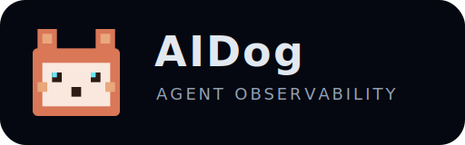
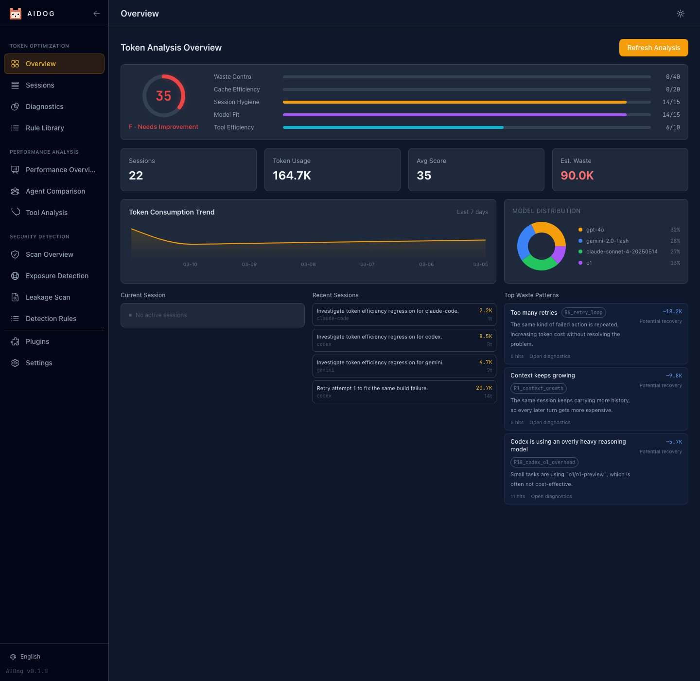
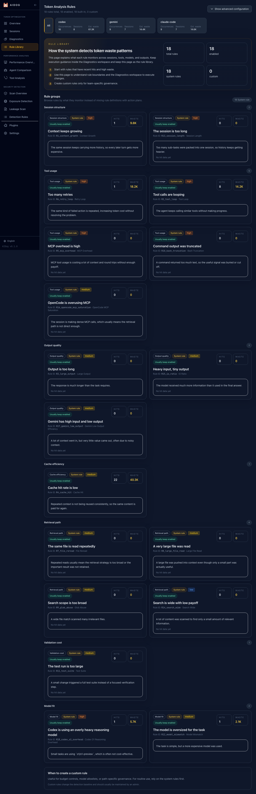
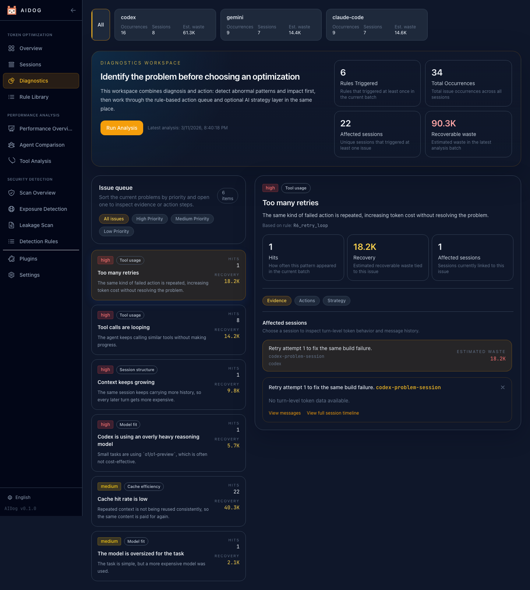
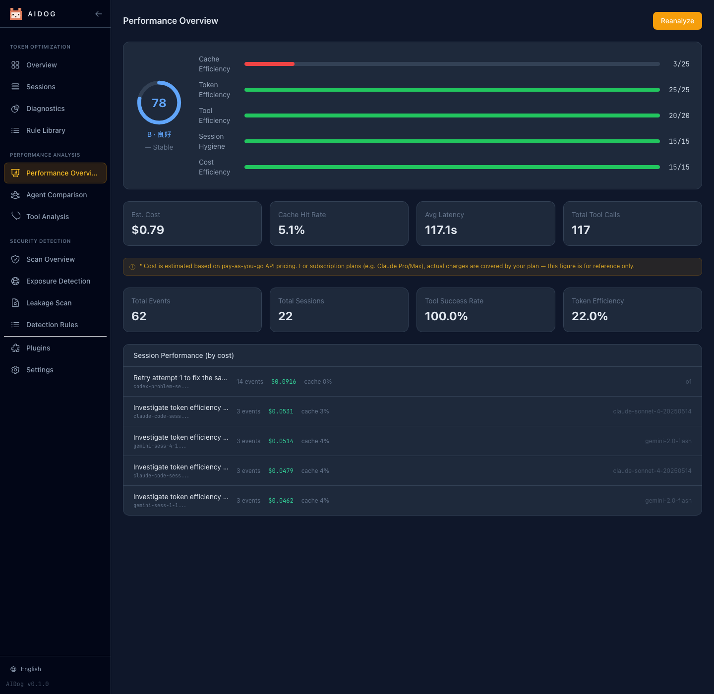
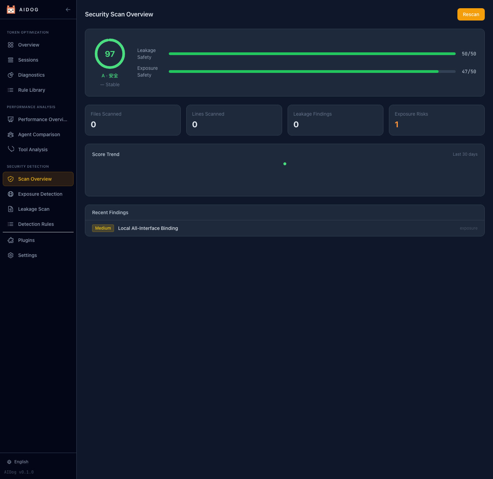

# AIDog



English | [简体中文](README.zh-CN.md) | [日本語](README.ja.md)

> Toolkit for AI agent operations with built-in collectors for Claude Code, Codex CLI, Gemini CLI, Aider, OpenCode, and OpenClaw, plus user-plugin extension, built to reduce operating cost, improve performance, and scan security risks.



`AIDog` is a local-first CLI and dashboard for AI agent operations. The current project ships with built-in collectors for Claude Code, Codex CLI, Gemini CLI, Aider, OpenCode, and OpenClaw, and it supports user plugins loaded from `~/.aidog/plugins/`. It combines token diagnostics, optimization workflows, performance scoring, security scans, plugin management, and a multilingual web dashboard in one toolkit.

## What It Covers

- Built-in collectors for Claude Code, Codex CLI, Gemini CLI, Aider, OpenCode, and OpenClaw
- User plugins from `~/.aidog/plugins/` for unsupported agents and in-house runtimes
- Token diagnostics with built-in rules for context growth, retry loops, MCP overhead, model mismatch, large output, and more
- AI-assisted optimization analysis with configurable providers such as Claude, OpenAI, Gemini, Kimi, GLM, MiniMax, Qoder, Ollama, and compatible endpoints
- Performance analysis with score breakdowns, agent comparison, tool analytics, cost estimation, and history snapshots
- Security scanning for public exposure risks and sensitive-data leakage
- Live dashboard sections for overview, sessions, diagnostics, rule library, performance, security, plugins, and settings
- English, Simplified Chinese, and Japanese UI in the web app

## Current Coverage

- Built-in plugin registry: Claude Code, Codex CLI, Gemini CLI, Aider, OpenCode, and OpenClaw
- User plugin loading from `~/.aidog/plugins/<plugin>/index.js`
- Starter skeleton: [SDK plugin skeleton](src/plugins/sdk/index.js)
- Integration docs: [Plugin Development Guide](docs/plugin-development.md)

## AI-built Project

About 90% of this project was written with AI assistance. Contributions from all coding agents are welcome, including Claude Code, Codex, Gemini, OpenCode, Aider, OpenClaw workflows, and human collaborators working with them.

## Quick Start

```bash
curl -fsSL https://raw.githubusercontent.com/AIAIDO/aidog/main/install.sh | bash
```

Or run it directly:

```bash
npx aidog serve
```

Typical first-run flow:

```bash
aidog setup
aidog sync
aidog analyze --ai
aidog serve --port 9527
```

## Common Commands

```bash
aidog setup
aidog sync
aidog watch
aidog stats --view session
aidog analyze --detail
aidog apply --list
aidog serve
aidog security scan
aidog performance overview
aidog performance agents
aidog plugins list
aidog config show
aidog compare --days 7
```

## Installation

Prerequisite: Node.js 18+

| Method | Command |
| --- | --- |
| Install script | `curl -fsSL https://raw.githubusercontent.com/AIAIDO/aidog/main/install.sh \| bash` |
| NPX | `npx aidog serve` |
| npm global | `npm install -g aidog` |
| GitHub source | `npm install -g github:AIAIDO/aidog` |

## Dashboard

Start the dashboard:

```bash
aidog serve --port 9527
```

The dashboard includes:

- Overview metrics and health score
- Session explorer and message drill-down
- Diagnostics page with evidence, affected sessions, and optimization hints
- Rule library for built-in and custom token rules
- Security overview, exposure detection, leakage scan, and security rule management
- Performance overview, agent comparison, tool analysis, cost signals, and score history
- Plugin management and runtime/provider settings
- Language switcher for `en`, `zh-CN`, and `ja`

## CLI Surface

Current top-level commands:

```bash
aidog setup
aidog sync
aidog stats
aidog analyze
aidog watch
aidog apply
aidog serve
aidog plugins
aidog compare
aidog config
aidog security
aidog performance
```

## Feature Screens

### Token Analysis Rules



### Diagnostics and Analysis



### Performance Optimization



### Security Scan



## Development

```bash
npm install
npm run build:web
npm run test
npm run docs:screenshots
```

`npm run docs:screenshots` starts the real local dashboard, opens it with Playwright, switches languages, and regenerates the README screenshots.

## Contributing

Issues, fixes, experiments, and AI-generated pull requests are all welcome. If you are building with an agent, feel free to let that agent contribute code here.

## License

[MIT](LICENSE)
