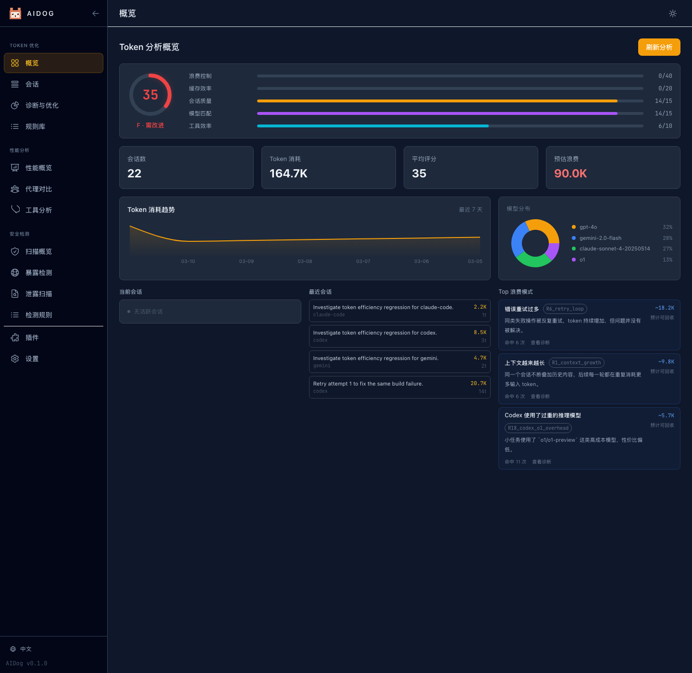
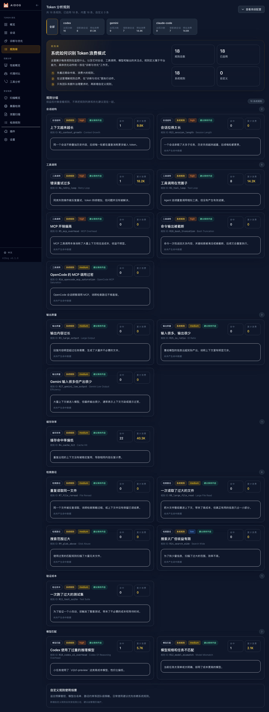
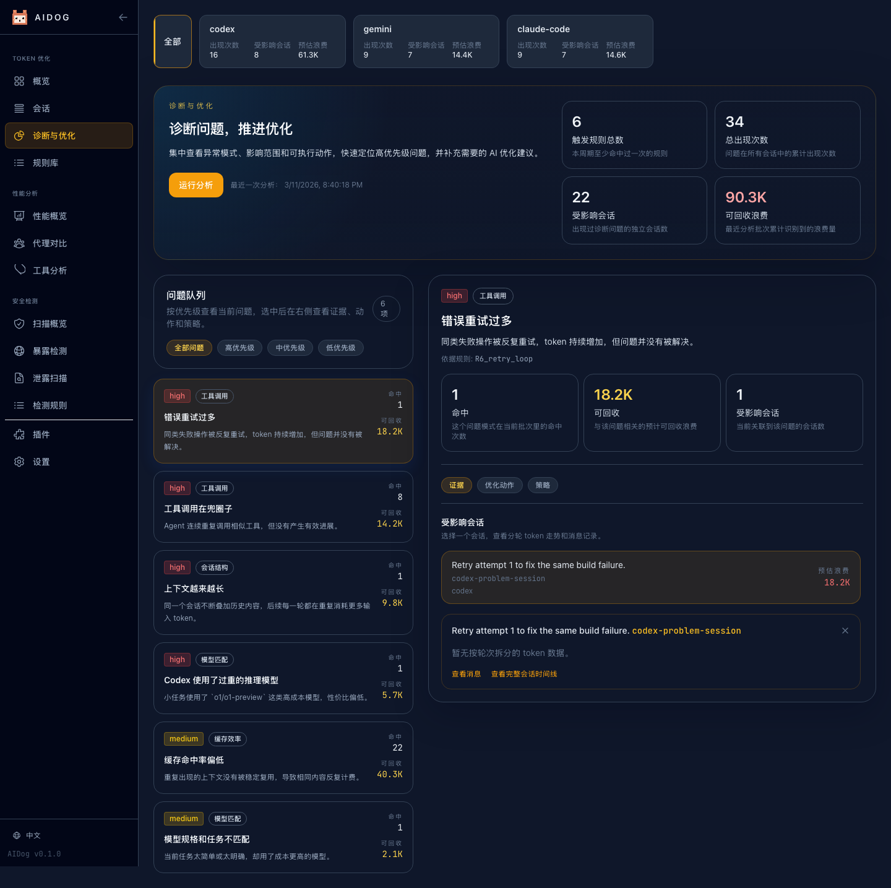
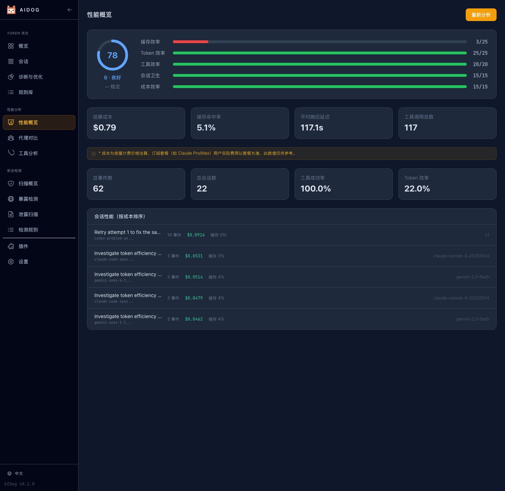
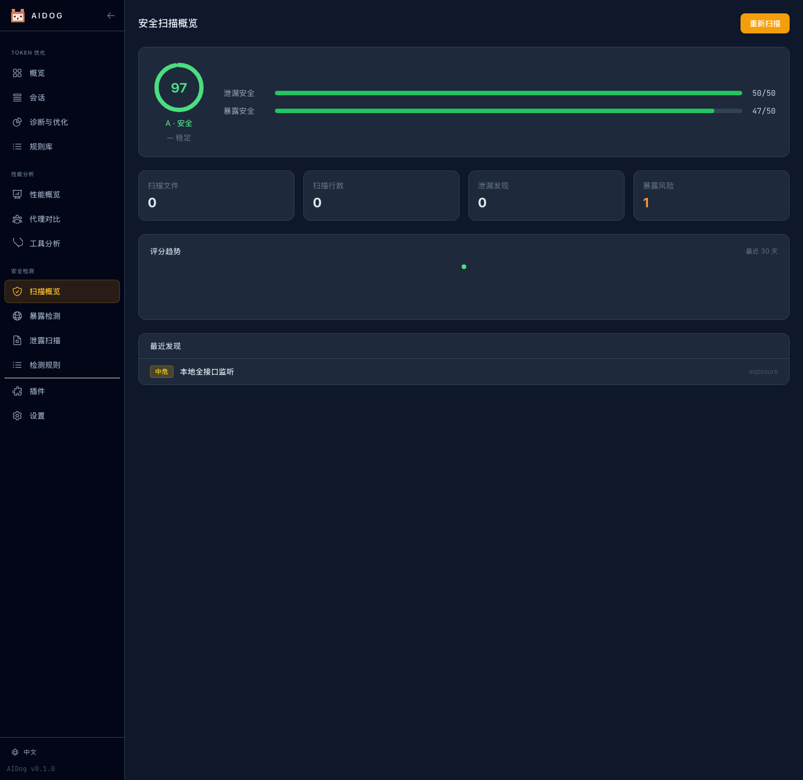

# AIDog


[English](README.md) | 简体中文 | [日本語](README.ja.md)

> 面向 AI Agent 工作流的工具链，当前内置支持 Claude Code、Codex CLI、Gemini CLI、OpenCode、OpenClaw，并可通过插件扩展到 SDK Agent，帮助优化使用成本、提升性能并扫描安全风险。



`AIDog` 是一个面向 AI Agent 工作流的本地优先 CLI 与 Web Dashboard。当前内置采集支持 Claude Code、Codex CLI、Gemini CLI、OpenCode 和 OpenClaw，也可以通过自定义插件扩展到基于 SDK 或内部平台构建的 Agent。它把成本优化、性能优化和安全扫描整合到一个界面中，帮助团队降低 token 开销、提升代理执行质量，并快速发现安全问题。

## 核心能力

- 面向 AI Agent 场景的成本优化、性能优化、安全扫描一体化能力
- 当前内置采集支持：Claude Code、Codex CLI、Gemini CLI、OpenCode、OpenClaw
- 可通过插件扩展到 SDK Agent、内部运行时和未原生支持的 CLI
- 成本优化：分析 token 浪费、结合规则库定位高开销模式、给出可执行优化建议
- 性能优化：通过健康分、趋势、模型与工具指标持续改进代理效率
- 内置规则引擎：识别上下文膨胀、工具循环、重试风暴、缓存命中不足等问题
- 安全扫描：检测泄漏风险与暴露面
- 性能分析：统计 token、成本、会话、工具调用和健康分
- 实时 Dashboard：支持英文、简体中文、日文切换

## 当前覆盖范围

- 当前原生采集：Claude Code、Codex CLI、Gemini CLI、OpenCode、OpenClaw
- SDK Agent 目前通过自定义插件接入，不属于内置自动发现范围
- SDK 骨架示例：[SDK 插件骨架](src/plugins/sdk/index.js)
- 接入文档：[插件开发指南](docs/plugin-development.md)

## AI 开发项目

本项目约 90% 代码由 AI 辅助完成。欢迎各类编程 Agent 参与贡献代码，包括 Claude Code、Codex、Gemini、OpenCode、Aider、OpenClaw 工作流，以及与这些 Agent 协作的人类开发者。

## 快速开始

```bash
curl -fsSL https://raw.githubusercontent.com/AIAIDO/aidog/main/install.sh | bash
```

或者直接运行：

```bash
npx aidog serve
```

## 常用命令

```bash
aidog setup
aidog sync
aidog serve
aidog stats --days 7
aidog analyze --ai
aidog security scan
aidog performance analyze
aidog compare
```

## 安装方式

前置要求：Node.js 18+

| 方式 | 命令 |
| --- | --- |
| 安装脚本 | `curl -fsSL https://raw.githubusercontent.com/AIAIDO/aidog/main/install.sh \| bash` |
| NPX | `npx aidog serve` |
| npm 全局安装 | `npm install -g aidog` |
| GitHub 源码安装 | `npm install -g github:AIAIDO/aidog` |

## 仪表盘

启动 Dashboard：

```bash
aidog serve --port 9527
```

界面包含：

- 总览指标与健康分
- 会话列表与消息明细
- Token 诊断与优化建议
- 安全总览、暴露检测、泄漏检测
- Token 规则库与安全规则库，支持内置和自定义规则
- 代理性能与工具性能页面
- 插件管理与运行时设置
- `en`、`zh-CN`、`ja` 三语切换

## 功能截图

### Token 分析规则



### 诊断和分析



### 性能优化



### 安全扫描



## 开发

```bash
npm install
npm run build:web
npm run test
npm run docs:screenshots
```

`npm run docs:screenshots` 会启动真实本地页面，使用 Playwright 打开浏览器，切换三种语言，并重新生成 README 中使用的截图。

## 贡献

欢迎提交 issue、修复、实验性改动以及 AI 生成的 PR。如果你正在使用某个 Agent 开发，也欢迎直接让它为本项目贡献代码。

## 许可证

[MIT](LICENSE)
